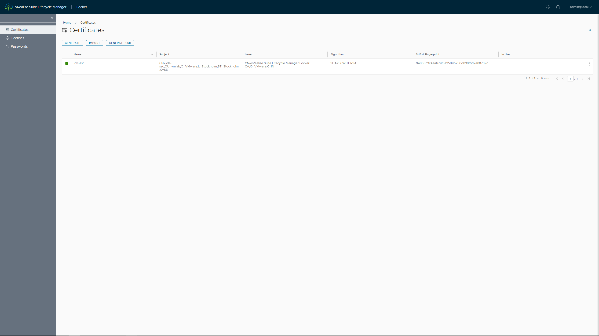
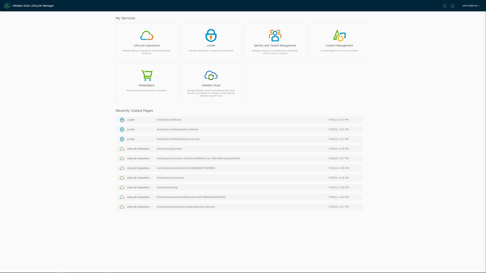
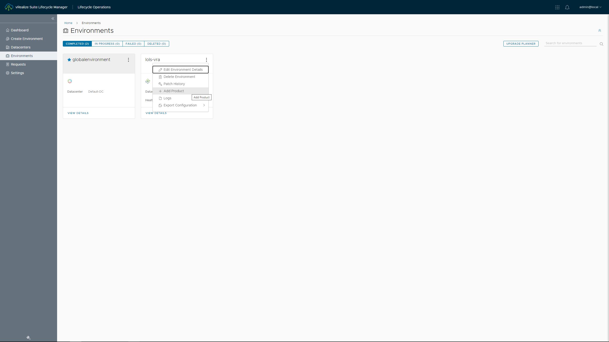
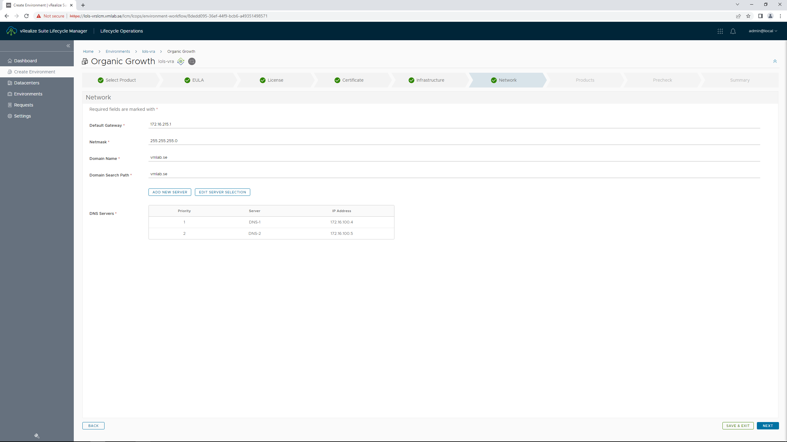
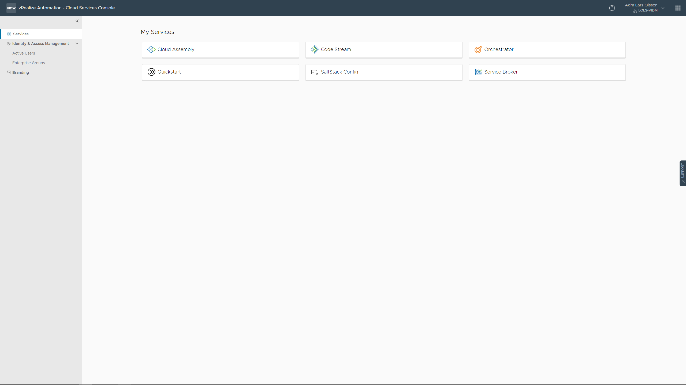
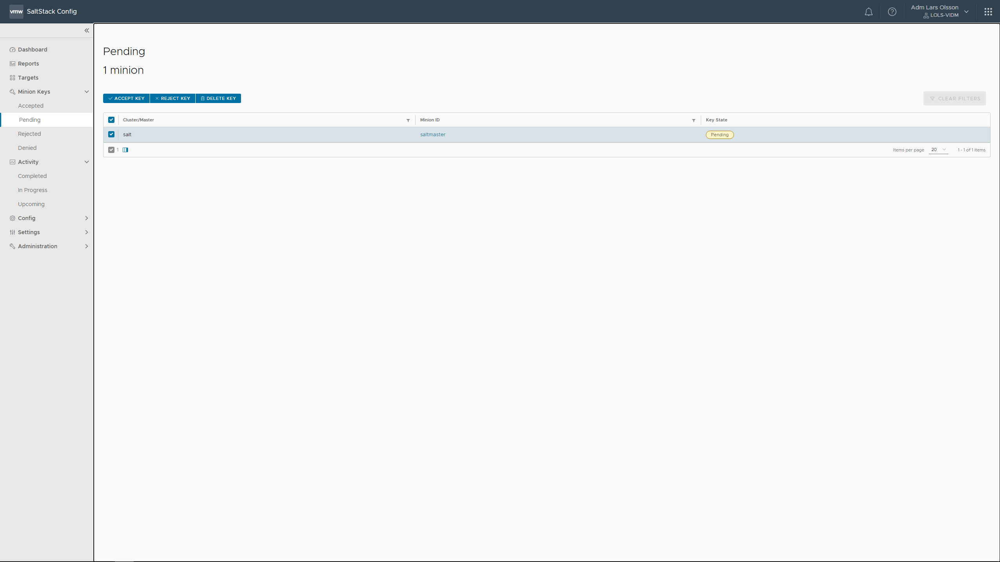
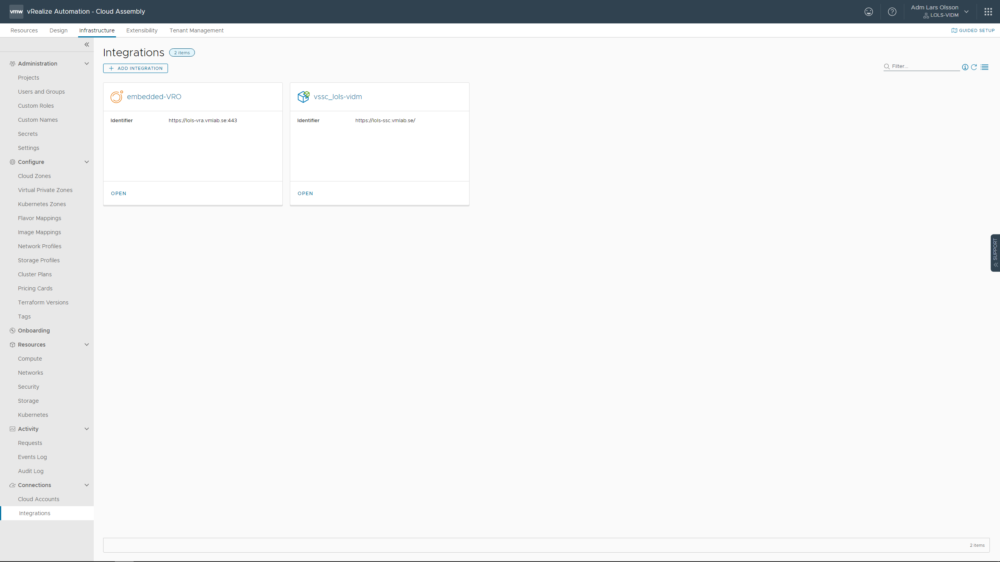
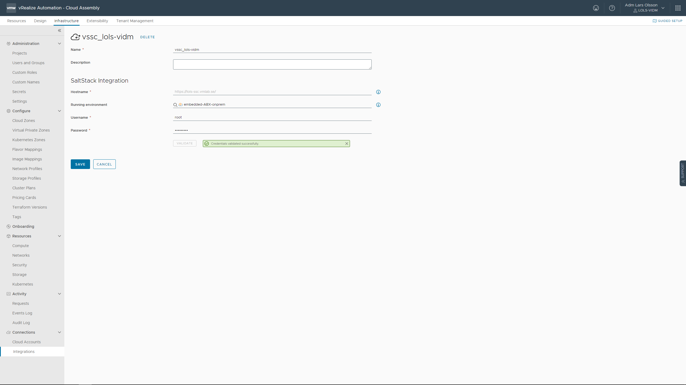

Before I started this I have downloaded VMware-vRealize-Automation-SaltStack-Config-8.10.1.0-20668427_OVF10.ova and placed a copy in /tmp on my vRSLCM node. If vRSLCM have internet access you can download it directly from within vRSLCM.


Locker.


Certificates - GENERATE.




Go to Lifecycle Operations.



Settings - Binary Mapping.


Click ADD BINARIES. Change Base Location to /tmp. Click DISCOVER. Select the SaltStack Config ova and click ADD.


Got to Environments. Click the three dots and choose Add Product.



VreAlize Automation SaltStack Config. New Install. Version. vRA-Integrated. Deployment Type: Standard. Click Next.


Add, Select and Validate your license. 


Select the Certificate you created earlier.


Select Cluster, Folder, Resource Pool, Network, Datastore. Enable Integrate with Identity Manager.


Network settings.



Check Integrate with Identity Manager.


Run Pre Check and verify everything is OK.


Submit.


Wait for installation to complete.


Make sure you got the right permissions to access SaltStack Config.


I'm adding both Super User and Administrator role in this example.





**If you get a 403 error message** while logging in it's likely to be caused by the self signed certificate we created in the beginning.

Follow the steps outlined [here](https://docs.vmware.com/en/VMware-vRealize-Automation-SaltStack-Config/8.10/install-configure-saltstack-config/GUID-21A87CE2-8184-4F41-B71B-0FCBB93F21FC.html) to take care of that. 

As this is my lab environment I will just disable Certificate validation by adding this to the end */etc/raas/raas* on the SSC node.

```
vra:
  validate_ssl: false
```

And run: *systemctl restart raas*


Go to Minion Keys - Pending. Select 'salt' and hit ACCEPT KEY.



Final steps. Go to Cloud Assembly - Infrastructure - Integrations. Open the SaltSTack integration named vssc_***



Change Running environment to: embedded-ABX-onprem. Enter the password you choose in step 8 during the easy installer setup day 1. Click VALIDATE and SAVE.



