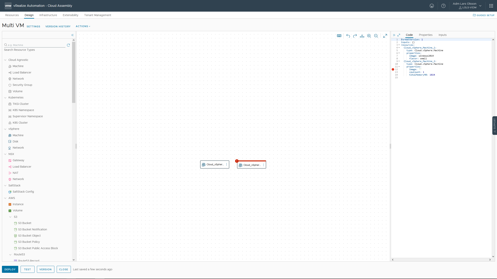
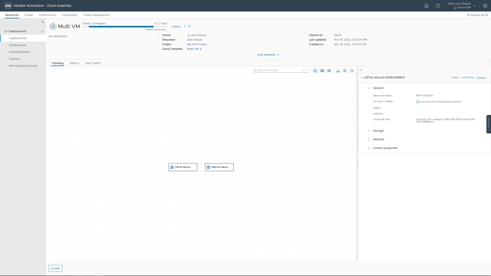

Start off bly cloning your Windows 2019 template.


Drag and drop another vSphere Virtual Machine out on the canvas.



Your YAML code will then look like this. We will make a few changes to it.

```
formatVersion: 1
inputs: {}
resources:
  Cloud_vSphere_Machine_1:
    type: Cloud.vSphere.Machine
    properties:
      image: windows2019
      flavor: small
  Cloud_vSphere_Machine_2:
    type: Cloud.vSphere.Machine
    properties:
      image: ''
      cpuCount: 1
      totalMemoryMB: 1024
```

First off we are adding inputs for the consumer to be able to select the size of the VMs. We are using flavor mappings in this example.

```
inputs:
  vmSize:
    title: VM Size
    type: string
    description: VM Size
    oneOf:
      - title: Small (2 CPUs, 4GB RAM)
        const: small
      - title: Medium (4 CPUs, 8GB RAM)
        const: medium
      - title: Large (8 CPUs, 12GB RAM)
        const: large
```

Secondly we are renaming the different vSphere machine objects to something more explanatory. 

```
resources:
  Cloud_vSphere_Machine_1:
resources:
  Cloud_vSphere_Machine_2:


resources:
  WebTier:
resources:
  DBTier:
```

Thirdly we make sure the DBTier is provisioned before WebTier by adding:

```
dependsOn:
  - DBTier
```

And finally we make sure the size input is used by the vSphere VMs by changing

```
flavor: small

flavor: '${input.vmSize}'
```

Your final code should look like this.

```
formatVersion: 1
inputs:
  vmSize:
    title: VM Size
    type: string
    description: VM Size
    oneOf:
      - title: Small (2 CPUs, 4GB RAM)
        const: small
      - title: Medium (4 CPUs, 8GB RAM)
        const: medium
      - title: Large (8 CPUs, 12GB RAM)
        const: large
resources:
  WebTier:
    type: Cloud.vSphere.Machine
    dependsOn:
      - DBTier
    properties:
      image: windows2019
      flavor: '${input.vmSize}'
  DBTier:
    type: Cloud.vSphere.Machine
    properties:
      image: windows2019
      flavor: '${input.vmSize}'
```


Go ahead and click DEPLOY. Give it a name and then DEPLOY. Then see the results.



If you don't want to use flavor mappings you could instead use:

```
inputs:
  cpu:
    type: integer
    description: Set the number of CPU's
    title: CPU
    enum:
      - 1
      - 2
      - 4
      - 8
    default: 2
  memory:
    type: integer
    minimum: 4
    maximum: 12
    description: Set the amount of memory
    title: Memory
```

```
  Cloud_vSphere_Machine_1:
    type: Cloud.vSphere.Machine
    properties:
      image: windows2019
      cpuCount: ${input.cpu}
      totalMemoryMB: ${input.memory * 1024}
```

Or you could use Property Groups. Here's a two blog posts explaining Property Groups.

https://blogs.vmware.com/management/2020/12/introducing-vrealize-automation-property-groups.html

https://veducate.co.uk/vra-property-groups/

