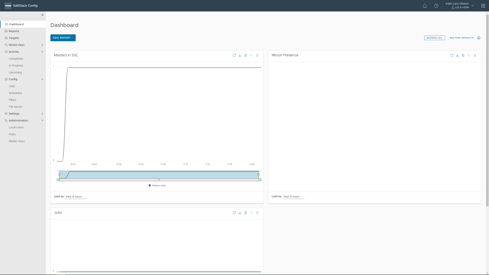
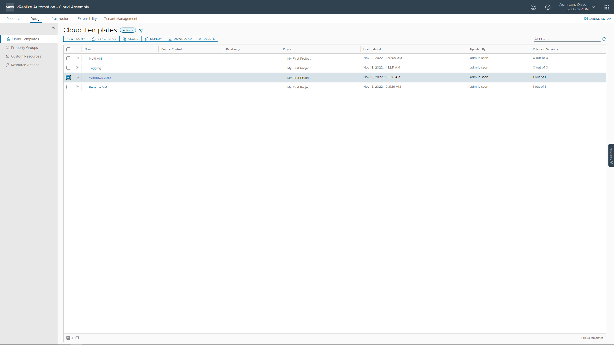
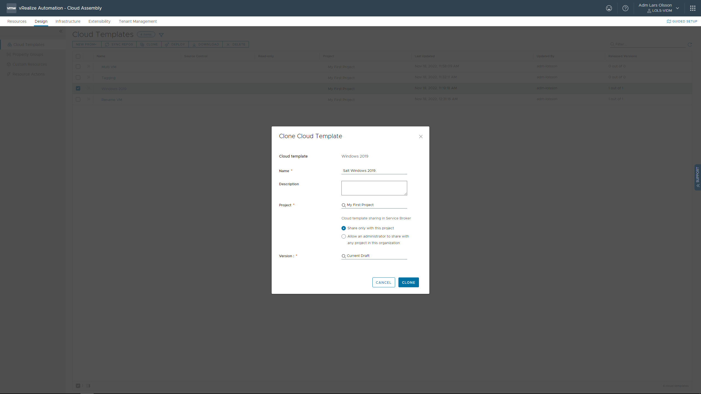

First we need to make some changes to the vSphere virtual machine template. Convert your template to a VM, boot it up and makes the following changes. Then convert it back to a template again. Make sure your newly modified template is selected in Cloud Assembly - Infrastructure - Image Mappings.


- *Create a firewall rule for TCP 445 – Allow on all profiles*

```
New-NetFirewallRule -Name "SMB445" -DisplayName "SMB445" -Protocol TCP -LocalPort 445

Set-Item (dir wsman:\localhost\Listener\*\Port -Recurse).pspath 445 -Force

Restart-Service winrm
```

- *Ensure SMB2 is enabled*

```
get-smbserverconfiguration | select EnableSMB2Protocol
```

- *Configure winrm*

```
winrm quickconfig -transport:http
```

- *Set UAC to never notify*

```
Select Start > Control Panel 

Click System Security

Under Action Center, choose Change User Account Control settings

Move the slider bar down to the Never notify selection and click OK

Reboot the machine for changes to take effect
```



Go to Config - File Server and click CREATE in the bottom left corner. Select Salt environment: base. Give your state file a name. I'm using /windows/remote-desktop/init.sls - copy and past the following example code. This will enable the Remote Desktop service.

```
enable_service_rds:
  service.enabled:
    - name: TermService

start_service_rds:
  service.running:
    - name: TermService
    
reg_enable_rds_connections:
  reg.present:    
    - name: HKLM\SYSTEM\CurrentControlSet\Control\Terminal Server
    - vname: fDenyTSConnections
    - vdata: 0
    - vtype: REG_DWORD
```


Go back to Cloud Assembly and Clone your Windows 2019 Cloud Template.





Add the following to your yaml code. As this is just a lab I'm not protection the password and will print it stright into my yaml code.

```
  Cloud_SaltStack_1:
    type: Cloud.SaltStack
    properties:
      hosts:
        - ${resource.Cloud_vSphere_Machine_1.id}
      masterId: saltstack_enterprise_installer
      minionId: ${self.resourceName}
      stateFiles:
        - /windows/remote-desktop/init.sls
      saltEnvironment: base
      additionalMinionParams:
        grains:
          customgrain: winserver
```

Windows Administrator username and password.

```
    remoteAccess:
      authentication: usernamePassword
      username: Administrator
      password: VMware1!
```

Final code should look like this.

```
formatVersion: 1
inputs: {}
resources:
  Cloud_SaltStack_1:
    type: Cloud.SaltStack
    properties:
      hosts:
        - ${resource.Cloud_vSphere_Machine_1.id}
      masterId: saltstack_enterprise_installer
      minionId: ${self.resourceName}
      stateFiles:
        - /windows/remote-desktop/init.sls
      saltEnvironment: base
      additionalMinionParams:
        grains:
          customgrain: winserver
  Cloud_vSphere_Machine_1:
    type: Cloud.vSphere.Machine
    properties:
      image: windows2019
      flavor: small
      remoteAccess:
        authentication: usernamePassword
        username: Administrator
        password: VMware1!
```

Click DEPLOY. Give it a name and click DEPLOY.


