Select your Windows 2019 Cloud Template and click CLONE.


Give the new Cloud Template a name. Select your project and version to clone.


Update your yaml code so it looks like [this](https://github.com/larols/vmware-aria/blob/main/aria-automation/assets/yaml/Rename%20VM.yaml). This will ask the user to input a name for the VM.

```
formatVersion: 1
inputs:
  hostname:
    type: string
    title: Input VM Name
    description: Name of your VM
resources:
  Cloud_vSphere_Machine_1:
    type: Cloud.vSphere.Machine
    properties:
      image: windows2019
      flavor: small
      newName: ${input.hostname}
```

You can hit TEST to verify this works.

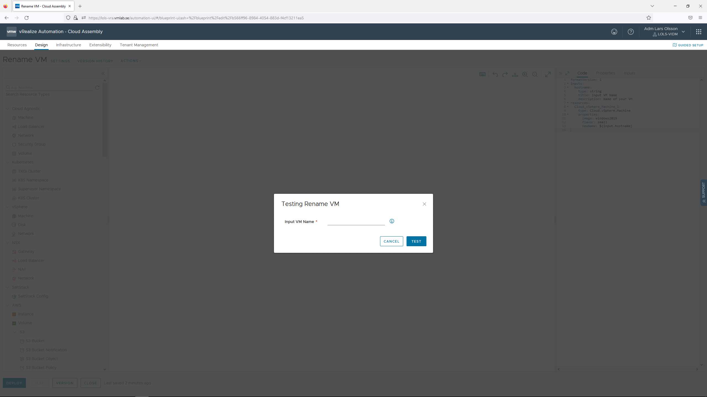

Lastly before hitting CLOSE. Record the Cloud Template ID from the URL. In my case the url is,

```
https://vra-fqdn/automation-ui/#/blueprint-ui;ash=%2Fblueprint%2Fedit%2Fb566ff96-8984-4054-883d-f4cf13211ea5
```

And the ID that I'm interested in keeping from the URL is,

```
b566ff96-8984-4054-883d-f4cf13211ea5
```

We will use this later.


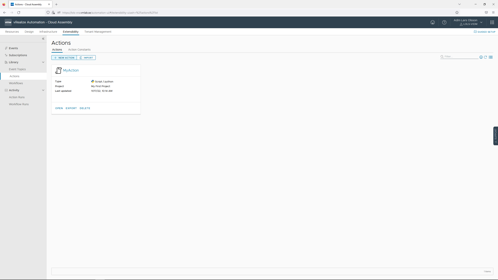

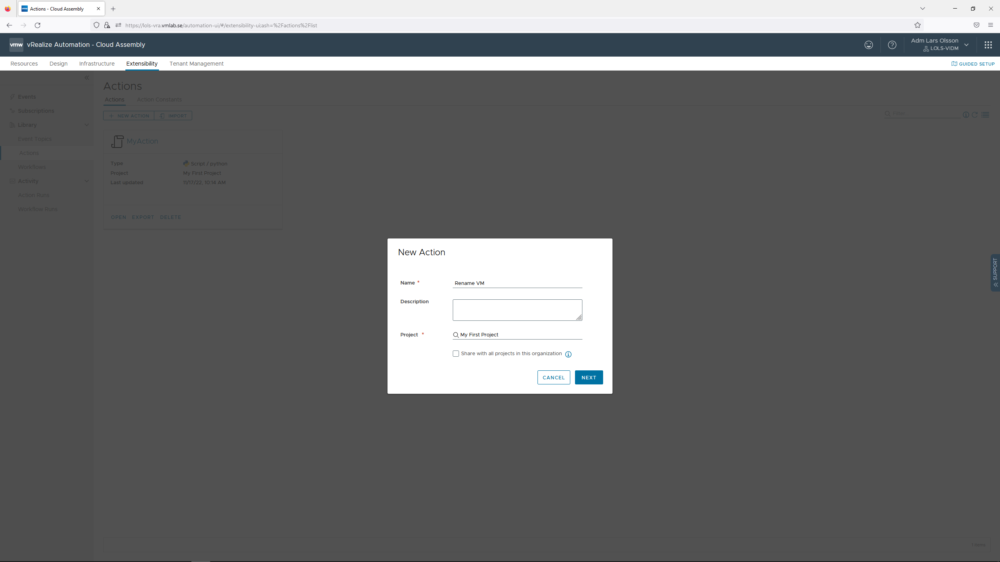

Select your scripting language of choice. In the example below I'm using Python. Click LOAD TEMPLATE and choose Rename VM. Hit LOAD.

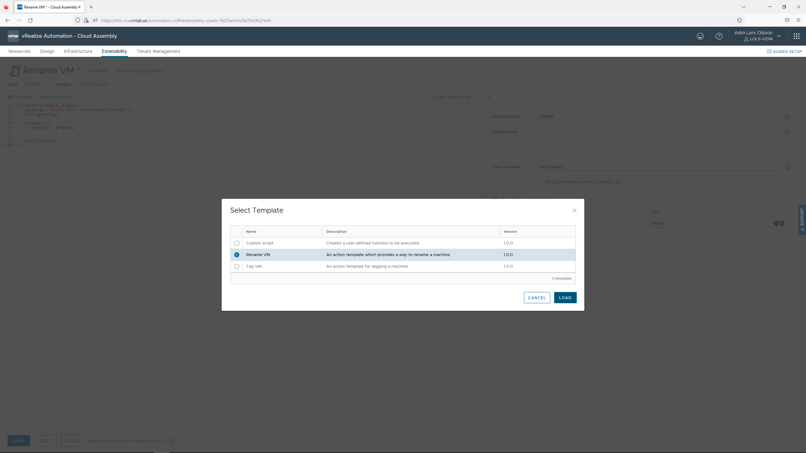

First off I will remove the two Default inputs that comes with the template. Thereafter you can change the FaaS provider to On Prem. Lastly modify the python script so that the new_name will be based on the customProperties from the Cloud Template. 

```
new_name = inputs["newName"] will be changed to new_name = inputs["customProperties"]["newName"]
```

Your script should then look like [this](https://github.com/larols/vmware-aria/blob/main/aria-automation/assets/python/RenameVM.py),

```
def handler(context, inputs):
    """Set a name for a machine
    :param inputs
    :param inputs.resourceNames: Contains the original name of the machine.
           It is supplied from the event data during actual provisioning
           or from user input for testing purposes.
    :param inputs.newName: The new machine name to be set.
    :return The desired machine name.
    """
    old_name = inputs["resourceNames"][0]
    new_name = inputs["customProperties"]["newName"]

    outputs = {}
    outputs["resourceNames"] = inputs["resourceNames"]
    outputs["resourceNames"][0] = new_name

    print("Setting machine name from {0} to {1}".format(old_name, new_name))

    return outputs
```

Save and Close your script.

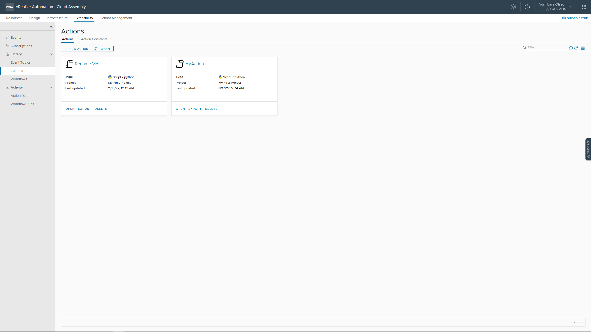

Lastly we need to create a subscription. Go to Extensibility - Subscriptions and click NEW SUBSCRIPTION. 

Give the subscription a name. Choose the Event Topic Compute Allocation. And set Action/Workflow to your newly created Action Rename VM.

Enable Condition 'Filter event in topic' and add *event.data.blueprintId ==''* together with the cloud template ID that you recorded earlier in between the ''. In my case it will looks like this,

```
event.data.blueprintId =='b566ff96-8984-4054-883d-f4cf13211ea5'
```

This will make sure this subscription only runs for this specific cloud template. Hit SAVE.

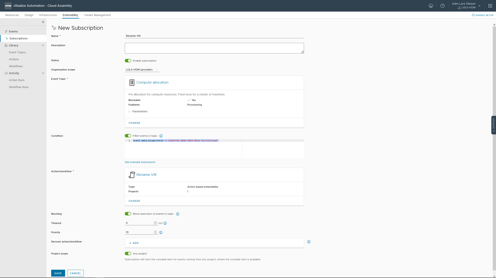

Your subscription is created and enabled.


Go back to the design tab. Select your Rename VM Cloud Template and click DEPLOY.

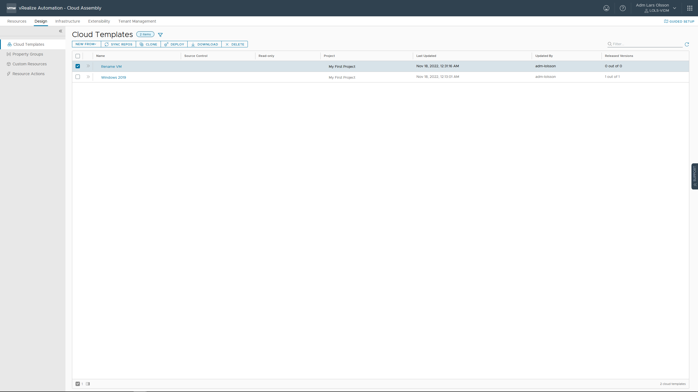

Give the deployment a name. Click NEXT.


Give the VM a name and click DEPLOY.

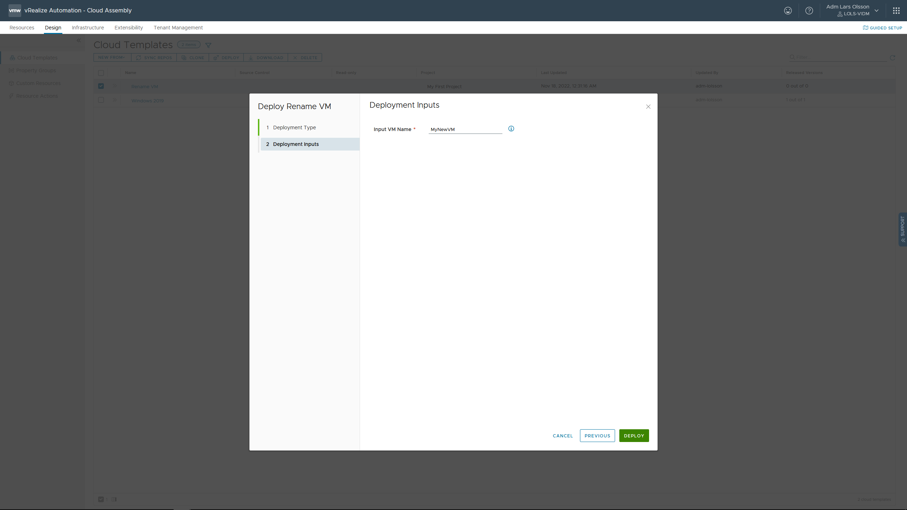

Deployment is running. You can see the old name togehter with the new name in Custom Properties.

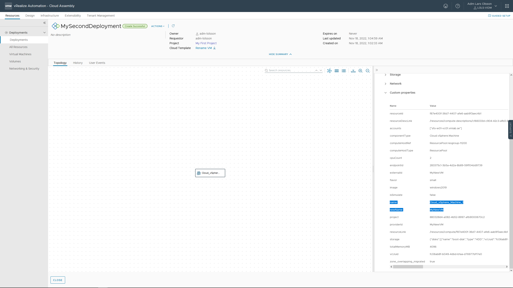

You can also see the Action being triggered in Extensibility - Actions Runs.

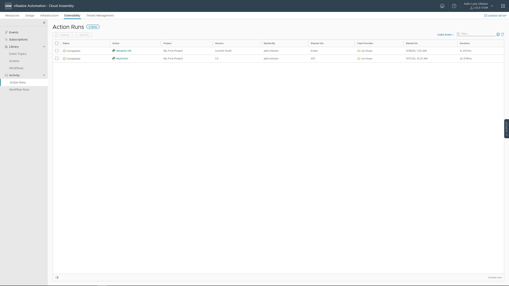

When the creation is completed your new VM will be name accordingly to your custom input. 

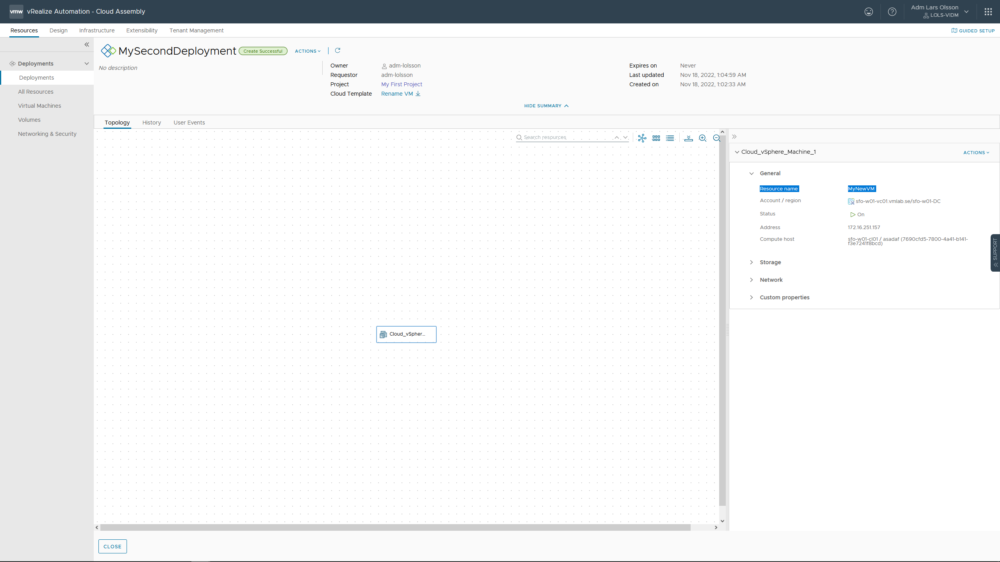

To publish this to the Service Broker Catalog you need to create a version of the Cloud Template and Release it to the Catalog.

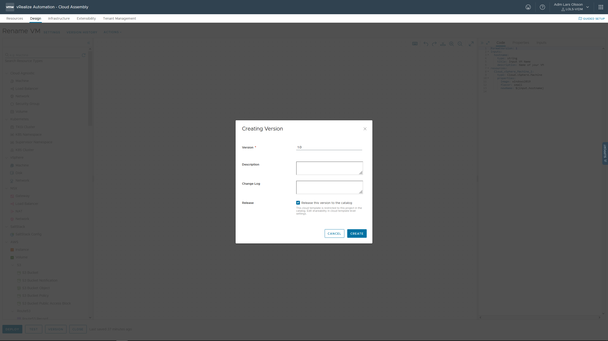

It will be added automatically to Service Broker after some time if you follow the steps in [Service Broker Content Sharing Policy](/aria-automation/servicebroker.md). You can also force it by going to Service Broker - Content and Policies - Content Sources - Edit your Cloud Template content source and click SAVE & IMPORT.

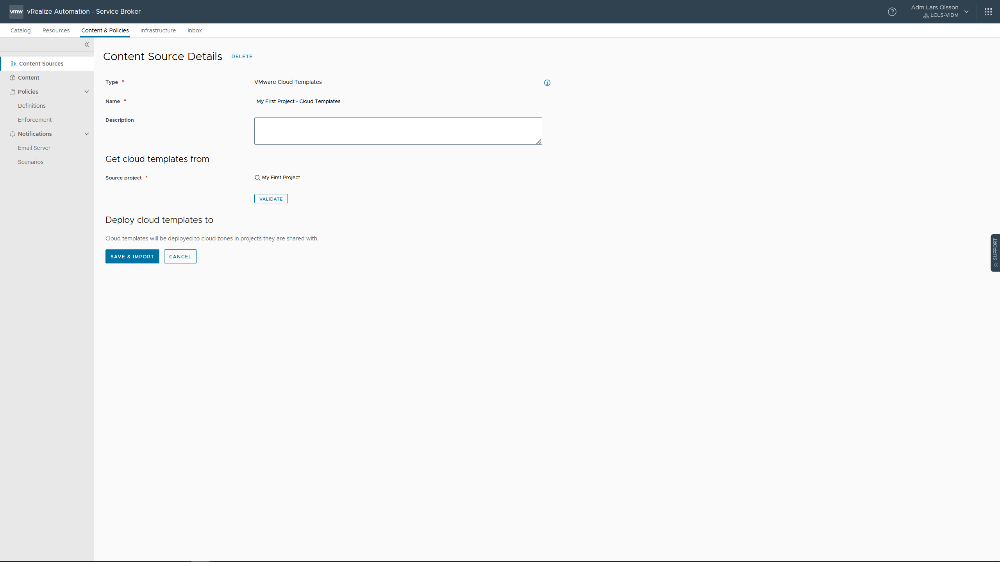

[Done.](https://larols.github.io/vmware-aria/)